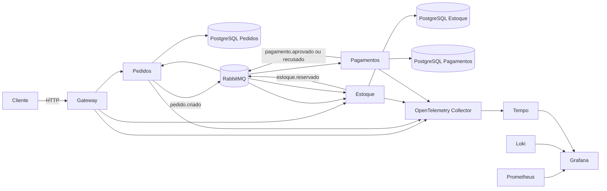

# Pedidos Veloz

MVP de uma plataforma de pedidos em microsserviços, preparado para desenvolvimento local com
Docker Compose e implantação em Kubernetes. O projeto mostra o caminho completo: código, eventos,
imagens, CI/CD, segurança, observabilidade e infraestrutura como código.

> **Identificação:** Antonio Silva - Análise e Desenvolvimento de Sistemas - Unifecaf - Tutor Fernando Melo
>
> **GitHub:** [@acsilv](https://github.com/acsilv)

## Arquitetura



O pedido é aceito com HTTP `202` e processado em segundo plano. Cada evento tem identificador,
versão e correlação. A outbox guarda eventos no mesmo banco da alteração de negócio e tenta a
publicação novamente se o RabbitMQ estiver fora do ar. Os consumidores registram os eventos já
tratados para evitar reserva ou cobrança duplicada.

| Serviço | Porta local | Responsabilidade |
|---|---:|---|
| Gateway | 8000 | Entrada HTTP e encaminhamento |
| Pedidos | interna | Estado e histórico do pedido |
| Estoque | interna | Disponibilidade, reserva e devolução |
| Pagamentos | interna | Autorização de pagamento em ambiente de demonstração |
| RabbitMQ | 15672 | Mensageria e painel administrativo |
| Grafana | 3000 | Métricas, logs e traces |
| Prometheus | 9090 | Consulta de métricas e alertas |

## Executar localmente

### Pré-requisitos

- Docker Desktop com Docker Compose v2,
- pelo menos 6 GB de memória disponíveis para o Docker,
- Git,
- Python 3.12 apenas se quiser executar os testes fora dos contêineres.

No Windows, marque a opção de usar contêineres Linux no Docker Desktop.

### 1. Preparar as variáveis

PowerShell:

```powershell
Copy-Item .env.example .env
```

Linux ou macOS:

```bash
cp .env.example .env
```

Edite `.env` e troque as senhas antes de compartilhar o ambiente. Esse arquivo não entra no Git.

### 2. Subir todo o ambiente

```bash
docker compose up --build -d
```

Confira a inicialização:

```bash
docker compose ps
docker compose logs -f gateway pedidos estoque pagamentos
```

Quando o Gateway aparecer como `healthy`, abra:

- documentação da API: <http://localhost:8000/docs>
- Grafana: <http://localhost:3000> (`admin`/`admin` no arquivo de exemplo)
- RabbitMQ: <http://localhost:15672>
- Prometheus: <http://localhost:9090>

### 3. Fazer um pedido aprovado

```bash
curl -X POST http://localhost:8000/api/v1/pedidos \
  -H "Content-Type: application/json" \
  -d @exemplos/pedido-aprovado.json
```

Copie o campo `id` e consulte o andamento:

```bash
curl http://localhost:8000/api/v1/pedidos/COLE_O_ID_AQUI
```

Em poucos segundos o estado deve chegar a `CONFIRMADO`.

Para ver os outros caminhos, use `exemplos/pedido-recusado.json` e
`exemplos/pedido-sem-estoque.json`. A recusa é controlada pelo prefixo fictício `falha_` no token.
Nenhum número de cartão real deve ser informado.

### 4. Encerrar

```bash
docker compose down
```

Para apagar também os dados locais:

```bash
docker compose down --volumes
```

## API pública

| Método | Caminho | Resultado |
|---|---|---|
| `POST` | `/api/v1/pedidos` | Aceita um pedido e retorna `202` |
| `GET` | `/api/v1/pedidos/{id}` | Retorna dados, estado e histórico |
| `GET` | `/api/v1/estoque/{sku}` | Consulta a posição atual do SKU |
| `GET` | `/saude` | Verifica se o processo está vivo |
| `GET` | `/pronto` | Verifica as dependências necessárias |
| `GET` | `/metricas/` | Expõe métricas no formato Prometheus |

Os estados possíveis são `RECEBIDO`, `AGUARDANDO_ESTOQUE`, `AGUARDANDO_PAGAMENTO`,
`CONFIRMADO` e `CANCELADO`.

## Testes e qualidade

```bash
python -m venv .venv
# Windows: .venv\Scripts\Activate.ps1
# Linux/macOS: source .venv/bin/activate
pip install -r requirements.txt -r requirements-dev.txt
ruff check comum servicos testes
pytest --cov=comum --cov=servicos
```

O teste rápido usado pelo pipeline pode ser executado com o Compose em funcionamento:

```bash
python scripts/teste_smoke.py
```

## Kubernetes

Os manifests ficam em `k8s/base` e o overlay de produção em `k8s/overlays/producao`.
O ambiente local usa Docker Compose. Os manifests são uma opção para implantação em um cluster
Kubernetes já configurado.
Antes do primeiro deploy:

1. publique as quatro imagens no GHCR,
2. use `acsilv` nas imagens ou deixe o workflow fazer `kubectl set image`,
3. crie o Secret usando `k8s/segredos.exemplo.yaml` apenas como referência,
4. confirme que o cluster possui Metrics Server para o HPA,
5. aplique o overlay.

```bash
kubectl apply -f k8s/base/namespace.yaml
kubectl -n pedidos-veloz create secret generic segredos-plataforma \
  --from-env-file=seus-segredos.env
kubectl apply -k k8s/overlays/producao
kubectl -n pedidos-veloz get pods,svc,hpa,pdb
```

O namespace exige o padrão `restricted` do Pod Security. As aplicações executam sem root, sem
capabilities extras e com sistema de arquivos somente leitura. O rolling update mantém as versões
antiga e nova enquanto as probes confirmam que o novo pod está pronto.

O OpenTelemetry Collector incluído no cluster escreve traces no log. Em um ambiente real, altere o
exporter para o serviço gerenciado ou para Tempo. O Compose já oferece a pilha completa para uso
local.

## Terraform

O diretório `infra/terraform` contém uma proposta opcional de infraestrutura. Nenhum recurso externo
é criado automaticamente. A configuração pode ser validada pelo pipeline sem executar
`terraform apply`. Uma aplicação manual pode criar recursos cobrados e deve ser feita somente após
revisão de custos e autorização do responsável pela conta.

## GitHub Actions e imagens

- `ci.yml`: lint, tipagem, testes, Compose, Kubernetes, Terraform e scans,
- `entrega.yml`: publica as quatro imagens em tags `v*` e pode implantar no cluster,
- imagens: `ghcr.io/acsilv/pedidos-veloz-<serviço>:<versão>`.

O deploy só é executado quando a variável `HABILITAR_DEPLOY` vale `true`. O ambiente `producao`
deve exigir aprovação e conter o secret `KUBE_CONFIG_B64`.

## Decisões do MVP

- **RabbitMQ:** desacopla estoque e pagamento, e permite retentar sem bloquear a requisição inicial.
- **Rolling update:** é nativo do Kubernetes e suficiente para reduzir risco sem a estrutura extra de
  blue/green ou canary.
- **HPA por CPU:** funciona com Metrics Server e resource requests. Escala por tamanho da fila com
  KEDA é uma evolução natural.
- **Sem Istio no MVP:** OpenTelemetry já entrega correlação ponta a ponta. O mesh seria justificável
  quando mTLS e controle avançado de tráfego passarem a ser requisitos operacionais.
- **Dados no cluster:** PostgreSQL e RabbitMQ em StatefulSets simplificam o ambiente do MVP. Em
  produção real, a recomendação é Cloud SQL e mensageria gerenciada ou operada por um controlador.
